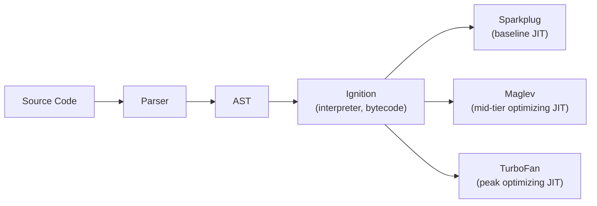
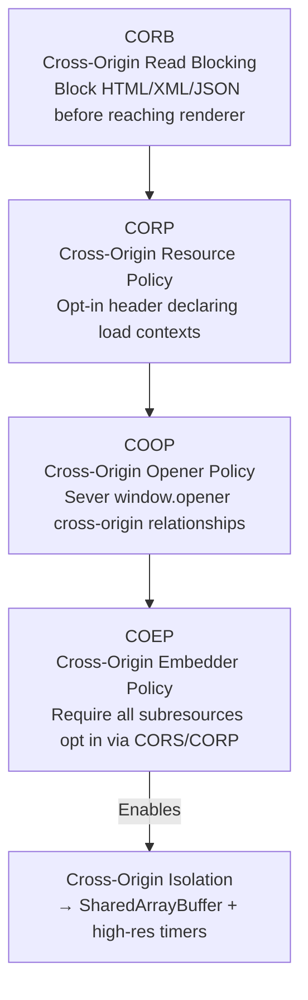

# Chromium Architecture and Vulnerabilities: A Comprehensive Security Research Report

> **Difficulty:** 🔴 Advanced | **Prerequisites:** C/C++, browser architecture, memory management | **Estimated reading time:** ~60 minutes

**Date:** April 2026  
**Classification:** Security Research  
**Scope:** Chromium architecture, vulnerability analysis, CVE case studies, exploitation techniques, and mitigation evolution (2008–2025)

---

## Executive Summary

Chromium, the open-source browser engine powering Google Chrome (65%+ market share), Microsoft Edge, Brave, Opera, and Electron applications, is one of the most complex and most-attacked software projects in existence. Its ~15 million lines of C++ code process untrusted input from the open internet, making it a perpetual high-value target for nation-state actors, commercial surveillance vendors (CSVs), and competitive security researchers.

This report provides a comprehensive analysis of Chromium's security architecture, vulnerability landscape, and exploit ecosystem. Key findings include:

- **Architecture as defense:** Chromium's multi-process model, introduced in 2008, remains the foundational security mechanism. Full exploit chains require 2–3 independent vulnerabilities (renderer RCE + sandbox escape ± kernel exploit), raising attack cost by orders of magnitude.
- **V8 JIT dominance:** ~60% of all in-the-wild Chrome exploits (2019–2025) originate from V8 JavaScript engine type confusion bugs in the TurboFan and Maglev JIT compilers.
- **Memory safety crisis:** ~70% of all high-severity Chromium security bugs are memory safety violations (UAF, buffer overflow, type confusion), with Use-After-Free alone accounting for ~35%.
- **Evolving threat actors:** Nation-state actors (DPRK/Lazarus, state-sponsored groups) and commercial surveillance vendors (NSO Group, Candiru/Intellexa) are the primary exploiters of Chrome zero-days.
- **Mitigation trajectory:** The V8 Sandbox (memory cage), MiraclePtr (UAF protection), PartitionAlloc hardening, Site Isolation, and Rust adoption represent a layered defense strategy that is measurably raising the exploitation bar.

---

## Table of Contents

1. [Chromium Architecture Overview](#1-chromium-architecture-overview)
2. [Process Model and Security Boundaries](#2-process-model-and-security-boundaries)
3. [Blink Rendering Engine](#3-blink-rendering-engine)
4. [V8 JavaScript Engine](#4-v8-javascript-engine)
5. [Mojo IPC and Inter-Process Communication](#5-mojo-ipc-and-inter-process-communication)
6. [Sandbox Architecture](#6-sandbox-architecture)
7. [GPU Process and Graphics Stack](#7-gpu-process-and-graphics-stack)
8. [Network Stack and Web Security](#8-network-stack-and-web-security)
9. [Memory Safety and Exploitation](#9-memory-safety-and-exploitation)
10. [Site Isolation and Spectre Mitigations](#10-site-isolation-and-spectre-mitigations)
11. [Notable CVEs and In-the-Wild Exploit Chains](#11-notable-cves-and-in-the-wild-exploit-chains)
12. [Security Evolution and Future Directions](#12-security-evolution-and-future-directions)
13. [CVE Statistics and Trends](#13-cve-statistics-and-trends)
14. [Conclusions](#14-conclusions)

---

## 1. Chromium Architecture Overview

*(Detailed analysis: [01_chromium_architecture_overview.md](docs/01_chromium_architecture_overview.md))*

### 1.1 Multi-Process Architecture

Chromium's defining architectural feature is its multi-process model, which mirrors the process isolation model of modern operating systems. Each functional unit runs in its own OS process with restricted privileges:

| Process Type | Role | Privilege Level | Sandbox |
|---|---|---|---|
| **Browser Process** | UI, navigation policy, storage, process orchestration | Full user privileges | None (trusted) |
| **Renderer Process** | HTML/CSS (Blink) + JavaScript (V8) execution | Minimal | Strict (most restricted) |
| **GPU Process** | Command buffer validation, compositing, GPU driver access | Restricted | Partial (wider than renderer) |
| **Network Service** | HTTP/QUIC/TLS/DNS handling for all origins | Restricted | Sandboxed (socket access only) |
| **Utility Processes** | Data decoding, audio, storage, ZIP extraction | Task-specific | Strict |
| **Extension Processes** | Extension background pages/service workers | Defined API surface | Sandboxed + permission-gated |

### 1.2 Key Design Principles

- **Rule of Two:** When handling untrusted input, at least two of three must hold: (1) sandboxed execution, (2) memory-safe language, (3) trusted input. This drives architectural decisions about where parsing occurs.
- **Content/Chrome separation:** The `content/` module provides embeddable multi-process browser infrastructure; `chrome/` adds Chrome-specific features. This enables downstream embedding (Electron, WebView).
- **Threading model:** Each process uses named threads — UI thread (browser coordination), IO thread (IPC dispatch), compositor thread (rendering), main thread (DOM/JavaScript execution).

### 1.3 Codebase Structure

The Chromium codebase spans ~15 million lines of C++ across key directories: `third_party/blink/renderer/` (Blink), `v8/` (V8 engine), `net/` (network stack), `sandbox/` (platform sandboxes), `mojo/` (IPC), `gpu/` (GPU command buffer), `cc/` (compositor), and `content/` (multi-process infrastructure).

---

## 2. Process Model and Security Boundaries

*(Detailed analysis: [01b_process_model_security.md](docs/01b_process_model_security.md))*

### 2.1 Trust Hierarchy

The most critical trust boundary is **renderer → browser**. Post-Spectre (2018), Chromium's threat model explicitly treats renderer processes as **compromised**:

- **`CanCommitURL()`:** Verifies a renderer's claimed navigation matches its process lock
- **`CanAccessDataForOrigin()`:** Gates all storage access against the process lock
- **`mojo::ReportBadMessage()`:** Kills renderers violating IPC invariants (evidence of compromise)
- **Browser maintains authoritative state** for origin, permissions, cookies — renderer claims are never trusted

### 2.2 Threat Model

Chromium defines two attacker levels:

1. **Web attacker:** Serves arbitrary content from controlled origins, executes JavaScript, uses standard web APIs. Defense: Same-Origin Policy + Site Isolation.
2. **Compromised renderer attacker:** Has arbitrary code execution within sandbox. Can read all process memory, send arbitrary Mojo messages. Defense: Site Isolation + CORB/ORB + OS sandbox + browser-side IPC validation.

### 2.3 Severity Classification

| Severity | Definition | Example |
|---|---|---|
| **Critical** | Sandbox escape, browser process RCE | Mojo IPC handler bug → browser process code execution |
| **High** | Sandboxed code execution, cross-origin data disclosure | V8 type confusion → renderer RCE |
| **Medium** | Requires user interaction, partial information disclosure | Navigation spoofing, cookie bypass |
| **Low** | Minor leaks, UI spoofing, DoS | Address bar confusion |

---

## 3. Blink Rendering Engine

*(Detailed analysis: [02_blink_rendering_engine.md](docs/02_blink_rendering_engine.md), [02b_blink_cves_analysis.md](docs/02b_blink_cves_analysis.md))*

### 3.1 Rendering Pipeline

Blink implements a multi-stage pipeline: **HTML Parsing → DOM Construction → Style Resolution → Layout (LayoutNG) → Paint → Compositing → Raster → Display**. Each stage transforms data representations, with security implications at every boundary.

### 3.2 Key Security Features

- **Oilpan GC:** Tracing garbage collector for C++ DOM objects, replacing error-prone `RefPtr` reference counting that was responsible for ~35% of renderer CVEs pre-2015.
- **LayoutNG:** Immutable, constraint-based layout engine eliminating mutable-state UAF bugs from the legacy layout system.
- **IDL Bindings:** Auto-generated V8↔Blink bridge code with type checking, security annotations (`[SecureContext]`, `[CrossOrigin]`), and GC integration.

### 3.3 Common Vulnerability Patterns

| Pattern | Mechanism | Example |
|---|---|---|
| **DOM UAF** | DOM mutation triggers callback that destroys object still referenced | Custom element `disconnectedCallback` frees parent node |
| **Type Confusion** | SVG/HTML namespace confusion, unchecked `static_cast` | Element created in SVG namespace moved to HTML context |
| **Reentrancy** | MutationObserver/custom element callbacks execute during DOM operations | Promise resolution microtask invalidates DOM state |
| **Integer Overflow** | CSS layout calculations overflow `LayoutUnit` arithmetic | Table/flexbox multi-pass algorithms with large values |

### 3.4 CWE Distribution in Blink CVEs

- CWE-416 (Use-After-Free): ~35%
- CWE-843 (Type Confusion): ~25%
- CWE-787 (Out-of-Bounds Write): ~15%
- CWE-125 (Out-of-Bounds Read): ~10%
- Other: ~15%

---

## 4. V8 JavaScript Engine

*(Detailed analysis: [03_v8_engine_architecture.md](docs/03_v8_engine_architecture.md), [03b_v8_cves_exploitation.md](docs/03b_v8_cves_exploitation.md))*

### 4.1 Compilation Pipeline

V8 processes JavaScript through a four-tier pipeline:

<!-- Diagram: V8 JavaScript engine four-tier compilation pipeline -->


Each tier trades compilation speed for code quality. **TurboFan** uses a sea-of-nodes IR with speculative optimizations based on type feedback — the primary source of V8 vulnerabilities.

### 4.2 Object Model

- **Hidden Classes (Maps):** Describe object layout, property offsets, and transitions
- **Elements Kinds:** Track array element types (SMI → DOUBLE → ELEMENTS); confusion between kinds is the foundation of V8 exploitation
- **Pointer Compression:** 32-bit offsets within 4GB cage, precursor to V8 Sandbox
- **Orinoco GC:** Generational garbage collector with parallel scavenge, concurrent marking, and incremental sweeping

### 4.3 V8 Vulnerability Taxonomy

V8's attack surface is dominated by **JIT compiler logic bugs** — not classic memory corruption:

| Vulnerability Class | Mechanism | Frequency |
|---|---|---|
| **Type Confusion** | Compiler infers narrower type than runtime reality | ~60% of V8 zero-days |
| **Bounds Check Elimination** | Compiler incorrectly removes array bounds checks | Common |
| **Incorrect Side-Effect Modeling** | Operation triggers callback the compiler doesn't model | Common |
| **Redundancy Elimination** | Compiler removes guards that aren't truly redundant | Moderate |
| **GC Bugs** | Missing write barriers → dangling pointers | Rare but high-value |
| **WebAssembly** | Type confusion at WASM-JS boundary | Emerging |

### 4.4 V8 Exploitation Techniques

The standard V8 exploit chain:

1. **Trigger type confusion** between `PACKED_DOUBLE_ELEMENTS` and `PACKED_ELEMENTS` arrays
2. **Build `addrof`/`fakeobj` primitives** — read tagged pointer as double (leak address) / write double interpreted as tagged pointer (forge object reference)
3. **Construct arbitrary R/W** by corrupting `ArrayBuffer` backing store pointer or length
4. **Achieve code execution** — historically via WASM RWX pages; now requires V8 Sandbox bypass

### 4.5 V8 Sandbox (Memory Cage)

The V8 Sandbox, enabled by default since Chrome ~103, is the most consequential mitigation:

- Reserves **1TB virtual address region** for V8 heap
- All V8 heap pointers are **40-bit sandbox-relative offsets**
- External references use **pointer table indirection** with type tags
- Code objects stored in **trusted space** outside sandbox, accessed via **Code Pointer Table**
- **Effect:** Converts "corrupt any V8 pointer → arbitrary R/W in process" to "corrupt any V8 pointer → arbitrary R/W only within 1TB sandbox"

### 4.6 Notable V8 CVEs (2020–2025)

| CVE | Date | Type | Component | ITW | Key Detail |
|---|---|---|---|---|---|
| CVE-2020-6418 | Feb 2020 | Type Confusion | TurboFan JSCallReducer | Yes | Side-effect modeling bug in `Array.prototype.pop` |
| CVE-2021-21224 | Apr 2021 | Type Confusion | Simplified Lowering | Yes | Integer signedness confusion in representation selection |
| CVE-2021-30551 | Jun 2021 | Type Confusion | TurboFan | Yes | CheckMaps elimination; used by Candiru spyware |
| CVE-2022-1096 | Mar 2022 | Type Confusion | TurboFan | Yes | Emergency patch; type transition handling |
| CVE-2022-4262 | Dec 2022 | Type Confusion | TurboFan | Yes | Object type transition during optimization |
| CVE-2023-2033 | Apr 2023 | Type Confusion | TurboFan/Maglev | Yes | First major Maglev-era zero-day |
| CVE-2023-3079 | Jun 2023 | Type Confusion | V8 | Yes | Third V8 zero-day of 2023 |
| CVE-2024-0519 | Jan 2024 | OOB Memory Access | Optimizing Compiler | Yes | Classical bounds check elimination bug |
| CVE-2024-4947 | May 2024 | Type Confusion | Maglev | Yes | First ITW Maglev exploit; Kaspersky discovery |
| CVE-2024-7971 | Aug 2024 | Type Confusion | JIT Compiler | Yes | NK (Citrine Sleet) attribution; chained with kernel bug |

---

## 5. Mojo IPC and Inter-Process Communication

*(Detailed analysis: [04_mojo_ipc_architecture.md](docs/04_mojo_ipc_architecture.md), [04b_ipc_vulnerabilities_cves.md](docs/04b_ipc_vulnerabilities_cves.md))*

### 5.1 Mojo Architecture

Mojo is Chromium's primary IPC mechanism, replacing the legacy `IPC::Channel` system. Core primitives:

- **Message Pipes:** Bidirectional, typed communication channels
- **Data Pipes:** Streaming data transfer (network responses, media)
- **Shared Buffers:** Mapped memory regions for bulk data
- **Mojom IDL:** Interface definition language generating type-safe C++/Java/JS bindings

### 5.2 IPC Security Model

- **"Validate all IPC from renderers"** — every message treated as potentially adversarial
- **`mojo::ReportBadMessage()`** — kills renderer on semantic validation failure
- **Capability-based access** — renderers only receive `PendingReceiver` handles for interfaces they're entitled to
- **Origin-bound factories** — `URLLoaderFactory` instances are bound to the renderer's origin

### 5.3 IPC Attack Surface

A compromised renderer can send messages to **200+ browser-side Mojo interface implementations**. Critical attack patterns:

- **UAF via IPC ordering:** Destroy object via one interface while callback on another holds dangling pointer
- **Confused deputy attacks:** Abuse `URLLoaderFactory` or `RenderFrameHost` to access resources of other origins
- **`base::Unretained` bugs:** Raw pointers in IPC callbacks that become dangling after object destruction
- **Handle smuggling:** Pass `PendingReceiver` for privileged interfaces through unvalidated channels

### 5.4 MojoJS as Attacker Tool

MojoJS bindings (available in test/debug builds and injected via `--enable-blink-features=MojoJS`) allow direct JavaScript interaction with Mojo interfaces, making IPC exploit development significantly easier. Real-world exploit kits use equivalent functionality achieved via V8 exploitation to forge Mojo messages.

---

## 6. Sandbox Architecture

*(Detailed analysis: [05_sandbox_architecture.md](docs/05_sandbox_architecture.md), [05b_sandbox_escape_cves.md](docs/05b_sandbox_escape_cves.md))*

### 6.1 Platform Implementations

**Windows Sandbox:**
- Restricted tokens + Low/Untrusted integrity levels
- Job objects (prevent process creation, clipboard access)
- Alternate desktop/window station isolation
- **Win32k lockdown** — blocks all GDI/USER syscalls from renderers (removes historically richest kernel attack surface)
- LPAC (Less Privileged App Container) tokens

**Linux Sandbox:**
- User/PID/Network namespace isolation
- **Seccomp-BPF** — syscall filtering allowing only ~40-60 syscalls for renderers
- **Zygote process** — pre-forked template for efficient sandbox-first process creation

**macOS Sandbox:**
- Seatbelt profiles with per-process-type restrictions
- Hardened Runtime with code signing
- Bootstrap port restrictions (prevents contacting arbitrary system services)

### 6.2 Sandbox Escape Taxonomy

| Escape Vector | Description | Frequency |
|---|---|---|
| **Browser Process IPC** | Exploit Mojo handler for browser-process code execution | Most common |
| **GPU Process** | Pivot through GPU process to reach GPU drivers (kernel space) | Increasing |
| **Kernel Exploitation** | Exploit kernel via allowed syscalls/ioctls | Platform-specific |
| **Logic Bugs** | Abuse design flaws (e.g., Android Intents) without memory corruption | Occasional |

### 6.3 Notable Sandbox Escape CVEs

| CVE | Date | Mechanism | Attribution |
|---|---|---|---|
| CVE-2019-5786 + CVE-2019-0808 | Mar 2019 | FileReader UAF → Win32k kernel EoP | State actor |
| CVE-2021-30632/30633 | Sep 2021 | V8 OOB write + IndexedDB UAF | ITW campaign |
| CVE-2022-0609 | Feb 2022 | Animation UAF + sandbox escape | DPRK (Lazarus) |
| CVE-2023-2136 | Apr 2023 | Skia integer overflow (GPU process) | ITW (TAG discovery) |
| CVE-2023-4762 | Sep 2023 | V8 type confusion + sandbox escape | Predator spyware |
| CVE-2024-7971 + kernel | Aug 2024 | V8 + Windows kernel EoP | DPRK (Citrine Sleet) |

### 6.4 Defense-in-Depth Mitigations

- **ASLR:** 30+ bits of entropy on 64-bit platforms
- **CFI:** Forward-edge control flow integrity (Clang CFI on Linux/ChromeOS, CFG on Windows)
- **PAC:** Pointer Authentication on ARM64 (Apple Silicon, recent Android)
- **MiraclePtr:** Converts UAF into deterministic crash; covers 50%+ of browser-process UAFs
- **PartitionAlloc:** Guard pages, randomized freelist, quarantine, MTE integration on ARM64

---

## 7. GPU Process and Graphics Stack

*(Detailed analysis: [06_gpu_process_architecture.md](docs/06_gpu_process_architecture.md), [06b_gpu_graphics_cves.md](docs/06b_gpu_graphics_cves.md))*

### 7.1 Architecture

The GPU process brokers all GPU operations via serialized command buffers. Components include:
- **Skia** — 2D graphics library for painting, rasterization, font rendering
- **ANGLE** — OpenGL ES to native GPU API translation (D3D, Metal, Vulkan)
- **Dawn** — WebGPU implementation
- **Viz** — display compositor and frame aggregation

### 7.2 Security Significance

The GPU process is an increasingly attractive sandbox escape target because:
- It has **broader privileges** than renderers (GPU driver access, display system interaction)
- GPU drivers execute in **kernel space** — bugs triggered via allowed ioctls bypass all user-space sandbox boundaries
- Its attack surface is large: Skia, ANGLE, WebGL/WebGPU, image decoders

### 7.3 Notable Graphics CVEs

- **CVE-2023-4863 (libwebp):** Heap buffer overflow in Huffman table construction; affected Chrome, Firefox, Safari, Signal, all Electron apps; linked to NSO Group's BLASTPASS exploit chain
- **CVE-2023-2136 (Skia):** Integer overflow in drawing operations; exploited via GPU process for sandbox escape
- **CVE-2020-15999 (FreeType):** Heap buffer overflow in font rendering; exploited in the wild

---

## 8. Network Stack and Web Security

*(Detailed analysis: [07_network_stack_architecture.md](docs/07_network_stack_architecture.md), [07b_network_web_security_cves.md](docs/07b_network_web_security_cves.md))*

### 8.1 Architecture

Since Chrome 75, the network stack runs in a dedicated sandboxed utility process, handling HTTP/1.1, HTTP/2, HTTP/3 (QUIC), TLS (BoringSSL), DNS, and certificate verification. This isolates network protocol parsing from the privileged browser process.

The network process is classified as **"the doom zone"** — C++ code parsing complex untrusted input with cross-origin data present. Compromise exposes all origins simultaneously.

### 8.2 Web Security Mechanisms

- **CORS / CORB / ORB:** Cross-origin resource access control
- **COOP / COEP / CORP:** Cross-origin isolation policies enabling `SharedArrayBuffer` access
- **CSP:** Content Security Policy enforcement in Blink
- **Certificate Transparency:** Mandatory for all publicly-trusted certificates
- **DNS-over-HTTPS:** Encrypted DNS resolution
- **HTTPS-First Mode:** Automatic HTTP → HTTPS upgrade

### 8.3 Extension Security

Extensions bridge the renderer-browser trust boundary. Manifest V3 hardening includes: no remote code execution (`eval()` banned), Declarative Net Request replacing `webRequest`, restricted CSP, and service worker-only background pages.

---

## 9. Memory Safety and Exploitation

*(Detailed analysis: [08_memory_safety_exploitation.md](docs/08_memory_safety_exploitation.md), [08b_memory_safety_cves_mitigations.md](docs/08b_memory_safety_cves_mitigations.md))*

### 9.1 The 70% Problem

Chromium's landmark finding: **~70% of serious security bugs are memory safety problems**. Of those, ~50% are Use-After-Free.

| Bug Class | Share of High/Critical CVEs | Trend |
|---|---|---|
| Use-After-Free (CWE-416) | ~35% | Declining (Oilpan, MiraclePtr) |
| Type Confusion (CWE-843) | ~25% | Stable/increasing (V8 JIT) |
| Out-of-Bounds Write (CWE-787) | ~15% | Stable (codecs, images) |
| Out-of-Bounds Read (CWE-125) | ~10% | Stable (info leak primitive) |
| Other | ~15% | — |

### 9.2 PartitionAlloc

Chromium's custom memory allocator, designed for security:

- **Super pages** (2MiB aligned) with **slot spans** and ~40 bucket size classes
- **Guard pages** protecting metadata and partition boundaries
- **XOR-encoded freelist** with shadow pointers
- **Type-based partitioning** — different object types in separate regions
- **BackupRefPtr (MiraclePtr)** — reference-counted quarantine for dangling pointer protection
- **MTE integration** — hardware-enforced memory tagging on ARM64

### 9.3 Exploitation Primitives

Standard Chromium exploitation flow:

1. **Trigger vulnerability** — UAF, type confusion, OOB write
2. **Heap grooming** — Leverage PartitionAlloc's LIFO slot allocation for deterministic object placement
3. **Build read/write primitive** — Corrupt `ArrayBuffer` backing store or length; or use V8 `addrof`/`fakeobj`
4. **Achieve code execution** — Overwrite vtable/function pointer, JIT code corruption, or ROP chain
5. **Sandbox escape** — Chain with IPC bug, GPU process exploit, or kernel vulnerability

### 9.4 Mitigation Technologies

| Mitigation | Target | Coverage |
|---|---|---|
| **V8 Sandbox** | V8 heap corruption → process R/W | ~25-30% of High/Critical CVEs |
| **MiraclePtr + Oilpan** | Use-After-Free | ~30-35% of High/Critical CVEs |
| **CFI** | Vtable hijacking | Raises bar for ~35% of UAFs |
| **PartitionAlloc hardening** | Heap grooming reliability | Raises bar for ~40% of heap corruption |
| **MTE** (ARM64) | UAF + buffer overflow (hardware) | Probabilistic detection at ~3-5% overhead |

### 9.5 Fuzzing Infrastructure

**ClusterFuzz** processes **10+ billion test cases per day** across all components:
- 700+ LibFuzzer targets
- Grammar-based JS fuzzing (Fuzzilli)
- Differential JIT testing (interpreter vs. compiler)
- Centipede next-generation fuzzer
- Despite this scale, JIT logic bugs often manifest as incorrect code generation rather than crashes, escaping coverage-guided fuzzers

---

## 10. Site Isolation and Spectre Mitigations

*(Detailed analysis: [09_site_isolation_architecture.md](docs/09_site_isolation_architecture.md), [09b_site_isolation_bypasses_cves.md](docs/09b_site_isolation_bypasses_cves.md))*

### 10.1 Site Isolation

Enabled by default on desktop since Chrome 67 (July 2018), Site Isolation ensures:
- **Every cross-site iframe** renders in its own process (OOPIF)
- **Renderer processes are locked** to at most one site upon first navigation commit
- **Cross-origin data** never enters the wrong renderer's address space
- **CORB/ORB** filters responses to prevent sensitive data reaching incorrect processes

### 10.2 Cross-Origin Security Stack

<!-- Diagram: Cross-origin security policy stack showing defense-in-depth layers -->


**COOP + COEP = Cross-Origin Isolation** → enables `SharedArrayBuffer` and high-resolution timers

### 10.3 Spectre Mitigations

Process isolation is Chrome's **primary Spectre defense** — any data in a process is considered accessible to all code in that process. Additional layers:
- `performance.now()` timer resolution reduced
- `SharedArrayBuffer` disabled without cross-origin isolation
- V8 index masking for speculative bounds checks
- Site-keyed JIT compilation

### 10.4 Compromised Renderer Protections

Even with arbitrary code execution in a renderer:
- **Cannot access cross-site data** (absent from the process address space)
- **Cannot spoof the address bar** (drawn by browser process)
- **Cannot bypass CORS/cookie scoping** (enforced by browser/network process)
- **Cannot forge navigation commits** (`CanCommitURL` verified by browser)

---

## 11. Notable CVEs and In-the-Wild Exploit Chains

*(Detailed analysis: [10_notable_cve_case_studies.md](docs/10_notable_cve_case_studies.md))*

### 11.1 Major In-the-Wild Exploit Chains (2019–2025)

| Chain | Date | Initial Access | Sandbox Escape | Attribution | Targets |
|---|---|---|---|---|---|
| **CVE-2019-5786 + CVE-2019-0808** | Mar 2019 | FileReader UAF | Win32k kernel EoP | State actor | Targeted individuals |
| **CVE-2020-6418** | Feb 2020 | V8 TurboFan type confusion | Unknown | State actor | Unknown |
| **CVE-2021-21166 + CVE-2021-21148** | Feb 2021 | Audio UAF + V8 heap overflow | Unknown | State actor | Armenian entities |
| **CVE-2021-30551 + CVE-2021-30554** | Jun 2021 | V8 type confusion | WebGL UAF | Candiru (CSV) | Journalists, activists |
| **CVE-2022-0609** | Feb 2022 | Animation UAF | Unknown second stage | DPRK (Lazarus) | 250+ media/crypto targets |
| **CVE-2022-2294** | Jul 2022 | WebRTC heap buffer overflow | Unknown | Candiru/Heliconia | Middle East targets |
| **CVE-2023-2033 + CVE-2023-2136** | Apr 2023 | V8 type confusion | Skia integer overflow (GPU) | Unknown | Unknown |
| **CVE-2023-4863** | Sep 2023 | libwebp heap overflow | N/A (library-level) | NSO Group (BLASTPASS) | iOS/multi-platform |
| **CVE-2024-7971 + kernel** | Aug 2024 | V8 type confusion | Windows kernel EoP | DPRK (Citrine Sleet) | Cryptocurrency industry |

### 11.2 Threat Actor Landscape

- **DPRK (Lazarus/Citrine Sleet):** Most prolific; shared exploit supply chain across intelligence and cryptocurrency theft operations
- **Commercial Surveillance Vendors (Candiru, NSO Group, Intellexa):** Purchase/develop browser zero-days for turnkey spyware sold to governments
- **Other State Actors:** Targeted campaigns against specific geopolitical targets

### 11.3 Pwn2Own Highlights

Chrome full-chain exploits at Pwn2Own command the highest payouts ($250,000+), reflecting exploitation difficulty. Manfred Paul's consistent success (2022, 2024) using V8 type confusion + Mojo sandbox escape demonstrates the persistent exploitability of JIT compiler attack surface.

### 11.4 Chrome VRP Impact

| Category | Maximum Reward |
|---|---|
| Full chain (RCE + sandbox escape) | $250,000+ |
| Renderer RCE with exploit | $180,000 |
| Sandbox escape from renderer | $125,000 |
| MiraclePtr bypass | $100,115–$250,128 |
| Site Isolation bypass | Up to $100,000 |

No MiraclePtr bypass has been successfully claimed as of mid-2024, validating the mitigation's effectiveness.

---

## 12. Security Evolution and Future Directions

*(Detailed analysis: [10b_security_evolution_future.md](docs/10b_security_evolution_future.md))*

### 12.1 Security Timeline

| Year | Milestone |
|---|---|
| 2008 | Chrome launch with multi-process architecture and sandbox |
| 2010 | VRP launch; seccomp-BPF on Linux |
| 2013 | Blink fork from WebKit; Oilpan GC development begins |
| 2015 | NPAPI removed; PPAPI sandboxing |
| 2016 | CFI deployed; servicification begins |
| 2018 | **Spectre disclosure; Site Isolation enabled by default** |
| 2019 | V8 Sandbox design begins; first ITW full-chain (CVE-2019-5786) |
| 2020 | Network service out-of-process; MiraclePtr development |
| 2022 | V8 Sandbox enabled; Rust support added to build system |
| 2023 | CVE-2023-4863 (libwebp) supply-chain lesson; Maglev zero-days emerge |
| 2024 | V8 Sandbox in VRP; MTE adoption on ARM64; expanded Rust usage |
| 2025 | Hardware security (MTE, PAC, CET); AI-assisted fuzzing; safe C++ |

### 12.2 Future Directions

1. **Memory Safety through Rust and Safe C++:** Rust for new security-critical code; "safe C++" dialect banning raw pointers; libc++ hardening. Full rewrite of 15M lines impractical — focus on safety tooling.

2. **V8 Sandbox Completion:** Eliminate all sandbox violations in V8 runtime; harden external pointer table; secure WASM escape vectors; achieve process-isolation-equivalent security guarantees.

3. **Hardware Security Adoption:**
   - **MTE** (ARM64): Probabilistic UAF/overflow detection at ~3-5% overhead
   - **PAC** (ARM64): Cryptographic protection for return addresses and function pointers
   - **CET** (x86-64): Shadow stacks defending against ROP

4. **AI/ML Vulnerability Detection:** LLM-assisted fuzzing generating semantically meaningful test cases for JIT compilers and IPC handlers.

5. **WebAssembly Security:** New proposals (WASM GC, threads, SIMD) expand the WASM-JS interaction surface, requiring careful V8 Sandbox integration.

### 12.3 Comparative Analysis

| Feature | Chrome | Firefox | Safari |
|---|---|---|---|
| Multi-process architecture | Since 2008 (mature) | Since 2016 (Fission) | Since 2017 (partial) |
| Site isolation | Full (desktop) | Fission (2021) | Limited |
| JS engine sandbox | **V8 Sandbox (unique)** | None | None |
| C++ UAF mitigation | **MiraclePtr + Oilpan** | None at scale | Limited |
| Memory-safe language | Rust (growing) | Rust (significant) | Swift (significant) |
| Bug bounty max | $250,000+ | $10,000+ | $200,000 |

Chrome leads in architectural depth-of-defense, particularly with the V8 Sandbox and MiraclePtr — both unique among browsers.

---

## 13. CVE Statistics and Trends

### 13.1 Annual CVE Totals

| Year | Total CVEs | Critical | High | In-the-Wild Exploits |
|---|---|---|---|---|
| 2019 | ~160 | 4 | 52 | 2 |
| 2020 | ~180 | 5 | 62 | 5+ |
| 2021 | ~240 | 7 | 85 | **14+** (record) |
| 2022 | ~220 | 6 | 78 | 9+ |
| 2023 | ~200 | 5 | 70 | 8+ |
| 2024 | ~190 | 4 | 65 | 7+ |

### 13.2 Most Targeted Components in Zero-Day Exploits

1. **V8 JIT compilers (TurboFan, Maglev):** ~60% of all ITW Chrome exploits
2. **Blink DOM/Layout:** ~15% (declining sharply post-MiraclePtr)
3. **Third-party libraries (libwebp, etc.):** ~10%
4. **GPU/Skia:** ~5%
5. **Other (network, media):** ~10%

### 13.3 Patch Timelines

| Category | Median Time to Fix | Median Time to Stable |
|---|---|---|
| Actively exploited (ITW) | **1-3 days** | **3-7 days** |
| Critical severity | 7-14 days | 14-21 days |
| High severity | 14-30 days | 30-42 days |

---

## 14. Conclusions

### Key Findings

1. **Multi-process architecture is the cornerstone:** Requiring 2-3 vulnerability chains for full compromise raises attack costs by orders of magnitude. Every subsequent mitigation builds on this foundation.

2. **V8 JIT is the dominant attack surface:** Type confusion in speculative optimizing compilers is fundamentally difficult to eliminate — these are logic bugs, not classic memory corruption. The V8 Sandbox is the correct architectural response.

3. **Memory safety is a generational challenge:** 70% of serious bugs from C/C++ memory unsafety will take a decade+ to fully address through Rust adoption, safe C++, and hardware mitigations.

4. **The threat landscape is state-level:** Chrome zero-days are exclusively exploited by nation-state actors and commercial surveillance vendors — not financially motivated criminals.

5. **Defense-in-depth works:** Each mitigation forces attackers to develop more complex chains. The progression from single-bug exploitation (pre-2008) to multi-bug chains (2008+) to chains requiring V8 sandbox bypass + process sandbox escape (2024+) demonstrates cumulative defensive progress.

### The Arms Race Continues

The fundamental lesson from 17 years of Chrome security: **defense in depth is a continuous process, not a checklist**. Multi-process sandbox (2008) → Site Isolation (2018) → V8 Sandbox (2024) → memory safety through language + hardware (2025+). The goal is to make exploitation progressively more expensive until the economics no longer favor the attacker.

---

## Practice & Lab Exercises

### Exercise 1: Launching Chrome with Security Flags 🟢 Beginner

**Prerequisites:** Chromium or Google Chrome installed on Linux, terminal access.

1. Launch Chrome with site-isolation and sandbox diagnostics enabled:
   ```bash
   google-chrome --enable-features=SitePerProcess,IsolateOrigins --chrome://version
   ```
2. Navigate to `chrome://version` and record the command-line flags, sandbox status, and V8 version.
3. Check the sandbox status directly:
   ```bash
   google-chrome --no-sandbox --chrome://sandbox 2>&1 | head -20
   ```
   Compare with a normal launch (without `--no-sandbox`) — observe that the sandbox reports as invalid when disabled.
4. Launch with explicit renderer process limit to observe process model:
   ```bash
   google-chrome --renderer-process-limit=2 --enable-features=SitePerProcess chrome://process-internals
   ```

**Expected output:** `chrome://version` shows the full command line and confirms `SitePerProcess` is active. `chrome://sandbox` shows "Sandboxed" for renderer processes under normal launch and "Not sandboxed" with `--no-sandbox`. This demonstrates the cost of disabling Chrome's primary defense boundary.

---

### Exercise 2: Inspecting Chrome's Sandbox Internals 🟢 Beginner

**Prerequisites:** Chrome browser on Linux.

1. Open `chrome://sandbox` and note the PID, sandbox type, and whether seccomp-BPF is active.
2. Open `chrome://process-internals` to see all running processes and their types (browser, renderer, GPU, network, utility).
3. Navigate to `chrome://version` and find the `--type=` flags for each subprocess.
4. From a terminal, confirm the process tree and sandbox profiles:
   ```bash
   ps aux | grep chrome | grep -E 'type=(renderer|gpu|utility)'
   cat /proc/$(pgrep -f 'type=renderer' | head -1)/status | grep -i seccomp
   ```

**Expected output:** Each renderer process should show `Seccomp: 2` (strict filtering mode) in `/proc/<pid>/status`. The GPU and network processes run in separate sandbox levels. This confirms Chrome's defense-in-depth: even if one process is compromised, seccomp-BPF limits available syscalls.

---

### Exercise 3: Examining V8 Optimization with d8 🟡 Intermediate

**Prerequisites:** V8 development build (`d8`) — install via `v8` dev channel or build from source.

1. Start `d8` and inspect optimization states:
   ```bash
   d8 --allow-natives-syntax
   ```
2. Inside `d8`, define a simple function and trigger optimization:
   ```javascript
   function add(a, b) { return a + b; }
   %PrepareFunctionForOptimization(add);
   for (let i = 0; i < 10000; i++) add(1, 2);
   %OptimizeFunctionOnNextCall(add);
   add(1, 2);
   print(%GetOptimizationStatus(add));
   ```
3. Observe the optimization status codes (1=optimized, 2=not optimized, etc.).
4. Trigger deoptimization by passing inconsistent types:
   ```javascript
   add("hello", "world");
   print(%GetOptimizationStatus(add));
   ```
5. Compare with Turbofan optimization flags:
   ```bash
   d8 --trace-opt --trace-deopt --allow-natives-syntax -e 'function f(x){return x+1};%PrepareFunctionForOptimization(f);for(let i=0;i<10000;i++)f(1);%OptimizeFunctionOnNextCall(f);f(1)'
   ```

**Expected output:** After `OptimizeFunctionOnNextCall`, the status should return `1` (optimized by Turbofan). After passing a string, deoptimization occurs and status changes. The `--trace-opt`/`--trace-deopt` output shows the Turbofan pipeline decisions — this is the exact mechanism exploited in V8 JIT CVEs where type confusion enables arbitrary code execution.

---

### Exercise 4: Observing Sandbox Boundaries with strace 🔴 Advanced

**Prerequisites:** Linux system, Chrome installed, `strace` available.

1. Find a renderer process PID:
   ```bash
   pgrep -a chrome | grep 'type=renderer' | head -1
   ```
2. Trace syscalls to observe seccomp filtering in action:
   ```bash
   sudo strace -p <renderer_pid> -e trace=write,read,mmap,ioctl -c 2>&1 | head -30
   ```
3. Attempt to trace a blocked syscall (observe `SIGSYS` delivery):
   ```bash
   sudo strace -p <renderer_pid> -e trace=socket,connect 2>&1 | head -20
   ```
4. Compare the browser process's syscall profile against the renderer:
   ```bash
   sudo strace -p $(pgrep -a chrome | grep -v 'type=' | head -1 | awk '{print $1}') -e trace=all -c 2>&1 | head -30
   ```
5. Observe Mojo IPC messages crossing process boundaries:
   ```bash
   sudo strace -p <renderer_pid> -e trace=sendmsg,recvmsg -f 2>&1 | head -40
   ```

**Expected output:** The renderer's `strace` count shows a heavily restricted syscall set (no `socket`, `connect`, `clone`). Attempts to trace blocked syscalls produce `SIGSYS` signals with `seccomp` in the error string. The browser process shows a much richer syscall profile. Mojo IPC shows `sendmsg`/`recvmsg` calls carrying serialized message payloads — this IPC boundary is exactly what sandbox escape CVEs target.

---

## Related Tracks

- [**Zero-Day Research & Exploit Development**](../zero_day/docs/00_MASTER_REPORT.md) — Browser exploitation is a major focus area in zero-day research; the V8 JIT and Mojo IPC techniques covered here are central to modern exploit development methodology.
- [**Linux Kernel Vulnerabilities & Exploitation**](../linux_kernel/docs/FINAL_REPORT.md) — Chrome runs on Linux and its sandboxing leverages kernel features (seccomp-BPF, namespaces); kernel exploits chain with browser bugs for full compromise.
- [**CPU Protection Rings & Vulnerabilities**](../ring_and_vulns/FULL_REPORT.md) — Sandbox boundaries map to CPU privilege rings; understanding Ring 0/3 boundaries is essential for understanding Chrome's multi-process security architecture.

---

## Appendix: Research Document Index

| Document | Topic | Word Count |
|---|---|---|
| [01_chromium_architecture_overview.md](docs/01_chromium_architecture_overview.md) | Chromium High-Level Architecture & Multi-Process Model | ~2,800 |
| [01b_process_model_security.md](docs/01b_process_model_security.md) | Process Model Security Analysis | ~3,300 |
| [02_blink_rendering_engine.md](docs/02_blink_rendering_engine.md) | Blink Rendering Engine Architecture | ~2,900 |
| [02b_blink_cves_analysis.md](docs/02b_blink_cves_analysis.md) | Blink CVE Analysis & Vulnerability Patterns | ~3,000 |
| [03_v8_engine_architecture.md](docs/03_v8_engine_architecture.md) | V8 JavaScript Engine Architecture | ~3,000 |
| [03b_v8_cves_exploitation.md](docs/03b_v8_cves_exploitation.md) | V8 CVEs & Exploitation Techniques | ~3,800 |
| [04_mojo_ipc_architecture.md](docs/04_mojo_ipc_architecture.md) | Mojo IPC System Architecture | ~3,000 |
| [04b_ipc_vulnerabilities_cves.md](docs/04b_ipc_vulnerabilities_cves.md) | IPC Vulnerabilities & CVEs | ~3,300 |
| [05_sandbox_architecture.md](docs/05_sandbox_architecture.md) | Sandbox Architecture (All Platforms) | ~3,500 |
| [05b_sandbox_escape_cves.md](docs/05b_sandbox_escape_cves.md) | Sandbox Escape CVEs & Techniques | ~4,300 |
| [06_gpu_process_architecture.md](docs/06_gpu_process_architecture.md) | GPU Process & Compositing Architecture | ~3,200 |
| [06b_gpu_graphics_cves.md](docs/06b_gpu_graphics_cves.md) | GPU/Graphics Library CVEs | ~3,000 |
| [07_network_stack_architecture.md](docs/07_network_stack_architecture.md) | Network Stack Architecture | ~2,600 |
| [07b_network_web_security_cves.md](docs/07b_network_web_security_cves.md) | Network & Web Security CVEs | ~3,100 |
| [08_memory_safety_exploitation.md](docs/08_memory_safety_exploitation.md) | Memory Safety & Exploitation Primitives | ~3,500 |
| [08b_memory_safety_cves_mitigations.md](docs/08b_memory_safety_cves_mitigations.md) | Memory Safety CVEs & Mitigations | ~3,500 |
| [09_site_isolation_architecture.md](docs/09_site_isolation_architecture.md) | Site Isolation Architecture | ~3,100 |
| [09b_site_isolation_bypasses_cves.md](docs/09b_site_isolation_bypasses_cves.md) | Site Isolation Bypasses & CVEs | ~3,100 |
| [10_notable_cve_case_studies.md](docs/10_notable_cve_case_studies.md) | Notable CVE Case Studies | ~4,000 |
| [10b_security_evolution_future.md](docs/10b_security_evolution_future.md) | Security Evolution & Future Directions | ~3,900 |

**Total research corpus: ~63,000 words across 20 detailed sub-topic documents**

---

*This report was compiled from 20 independent research investigations conducted by specialized research agents, each providing complementary perspectives on Chromium's architecture and security landscape.*
