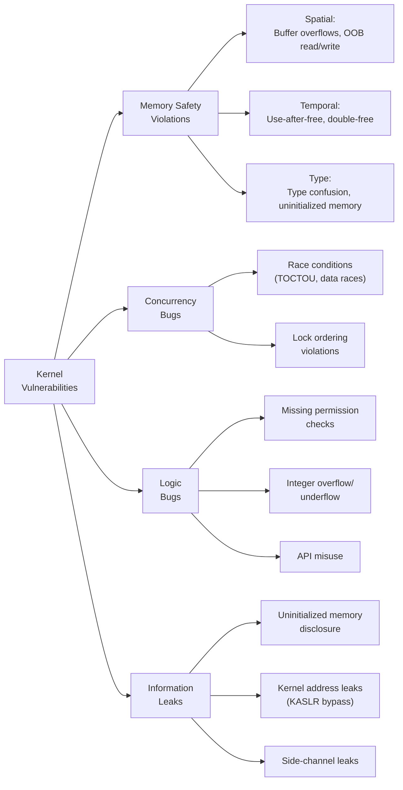
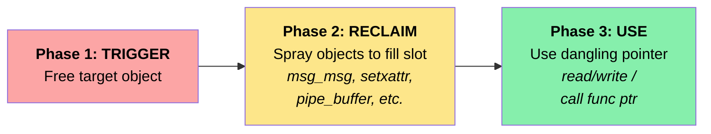
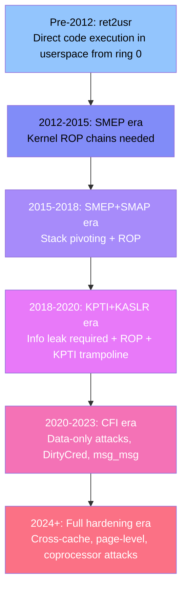

# Linux Kernel Vulnerabilities and Exploitation Techniques
## A Comprehensive Research Report

> **Difficulty:** 🔴 Advanced | **Prerequisites:** C programming, Linux internals, operating systems | **Estimated reading time:** ~60 minutes

**Date:** April 2026  
**Classification:** Technical Research Report  
**Total Research Volume:** 20 detailed chapters, ~960KB, 20,000+ lines of technical content

---

## Executive Summary

The Linux kernel is the most widely deployed operating system kernel in the world, running on everything from embedded devices and smartphones (Android) to cloud infrastructure, supercomputers, and critical national infrastructure. Its monolithic architecture — where all subsystems including device drivers, file systems, networking stacks, and security frameworks share a single address space in ring 0 — creates an enormous attack surface. With over **37 million lines of code** as of kernel 7.x (2026), approximately **460+ system calls** on x86-64, and thousands of device drivers, the kernel presents a uniquely challenging security landscape.

This report provides an exhaustive analysis of Linux kernel security across ten major dimensions: architecture and attack surface, vulnerability classes, memory corruption exploitation, race conditions, exploitation techniques, mitigation mechanisms, mitigation bypasses, notable CVEs, vulnerability discovery methods, and defense strategies. The research draws from authoritative sources including Google Project Zero, grsecurity, published CVE exploit writeups, academic research, and the Linux kernel security community.

### Key Findings

1. **Use-After-Free (UAF) dominates**: UAF vulnerabilities account for ~25-30% of kernel CVEs and **67% of in-the-wild kernel 0-days** (Google Project Zero data). They are the single most exploited vulnerability class.

2. **Exploitation complexity has increased but remains feasible**: Modern kernels deploy KASLR, SMEP, SMAP, KPTI, CFI, and slab hardening, yet researchers consistently demonstrate bypasses through data-only attacks, cross-cache techniques, and side-channel information leaks.

3. **Data-only attacks are the future**: Techniques like DirtyCred, DirtyPipe, and Dirty Pagetable allow full privilege escalation without hijacking control flow, bypassing CFI and other code execution defenses entirely.

4. **Syzkaller has transformed vulnerability discovery**: Google's coverage-guided kernel fuzzer has found **5,000+ bugs** since its deployment, fundamentally changing the kernel security landscape.

5. **Container escapes via kernel exploits remain practical**: Containers share the host kernel, making kernel vulnerabilities a direct path to container escape. Notable examples include CVE-2022-0185 and CVE-2024-1086.

6. **Rust integration offers long-term hope**: The introduction of Rust in Linux 6.1 provides memory safety guarantees at compile time, potentially eliminating entire vulnerability classes in new subsystems.

---

## Table of Contents

### Part I: Foundation
- [Chapter 1: Linux Kernel Architecture & Attack Surface](#chapter-1-linux-kernel-architecture--attack-surface)
- [Chapter 2: Common Kernel Vulnerability Classes](#chapter-2-common-kernel-vulnerability-classes)

### Part II: Vulnerability Deep Dives
- [Chapter 3: Memory Corruption Vulnerabilities](#chapter-3-memory-corruption-vulnerabilities)
- [Chapter 4: Race Conditions & Use-After-Free](#chapter-4-race-conditions--use-after-free)

### Part III: Exploitation
- [Chapter 5: Kernel Exploitation Techniques](#chapter-5-kernel-exploitation-techniques)
- [Chapter 6: Kernel Mitigation Mechanisms](#chapter-6-kernel-mitigation-mechanisms)
- [Chapter 7: Mitigation Bypass Techniques](#chapter-7-mitigation-bypass-techniques)

### Part IV: Real-World Impact
- [Chapter 8: Notable CVEs & Case Studies](#chapter-8-notable-cves--case-studies)

### Part V: Offense & Defense
- [Chapter 9: Kernel Fuzzing & Vulnerability Discovery](#chapter-9-kernel-fuzzing--vulnerability-discovery)
- [Chapter 10: Kernel Hardening & Defense Strategies](#chapter-10-kernel-hardening--defense-strategies)

---

# PART I: FOUNDATION

---

## Chapter 1: Linux Kernel Architecture & Attack Surface

> **Detailed research:** [`01a_kernel_architecture.md`](01a_kernel_architecture.md) | [`01b_attack_surface.md`](01b_attack_surface.md)

### 1.1 Monolithic Architecture

The Linux kernel is a **monolithic kernel** where the entire OS core — process management, memory management, file systems, device drivers, networking stacks, and security frameworks — executes within a single shared address space in CPU ring 0. This design, chosen by Linus Torvalds over microkernel alternatives, provides performance advantages but means **a single vulnerability in any subsystem can compromise the entire system**.

### 1.2 Attack Surface by the Numbers

| Metric | Value |
|--------|-------|
| Total lines of code | ~37 million (v7.0-rc, 2026) |
| System calls (x86-64) | ~460+ |
| Device drivers | ~60-65% of total code |
| Kernel modules | Thousands available |
| ioctl commands | Thousands across all drivers |
| Supported architectures | 20+ |

### 1.3 Key Attack Surface Areas

1. **System Call Interface**: ~460+ entry points, each a potential attack vector
2. **ioctl Handlers**: Unstructured, per-driver validation with thousands of commands
3. **Networking Stack**: Remotely reachable, complex protocol parsers (TCP/IP, Netfilter, wireless)
4. **Device Drivers**: Largest code volume, variable quality, often third-party
5. **File System Parsers**: Handle untrusted on-disk formats
6. **eBPF Subsystem**: JIT compiler with complex verifier — frequent bypass targets
7. **io_uring**: High-performance I/O with massive kernel surface (60% of Google kCTF submissions)
8. **USB Stack**: Processes untrusted physical device input

### 1.4 The User Namespace Amplifier

User namespaces (`CLONE_NEWUSER`) are a critical attack surface amplifier — they grant unprivileged users access to kernel code paths that were previously root-only (e.g., mounting filesystems, creating network namespaces, interacting with netfilter). Many kernel exploits require `CONFIG_USER_NS` to reach vulnerable code.

### 1.5 Monolithic vs. Microkernel Security

A 2018 study found that **40% of Linux CVEs would be impossible in a verified microkernel** due to architectural isolation. The monolithic design creates five key security weaknesses:

1. **Massive Trusted Computing Base** — All 37M LOC run at ring 0
2. **No fault isolation** — One driver bug compromises everything
3. **Privilege accumulation** — Any kernel code has full hardware access
4. **Transitive reachability** — User input traverses multiple subsystems
5. **Dynamic module loading** — Attack surface can expand at runtime

---

## Chapter 2: Common Kernel Vulnerability Classes

> **Detailed research:** [`02a_vuln_classes.md`](02a_vuln_classes.md) | [`02b_vuln_patterns.md`](02b_vuln_patterns.md)

### 2.1 Vulnerability Taxonomy

<!-- Diagram: Kernel vulnerability taxonomy showing major bug classes and subcategories -->


### 2.2 Vulnerability Distribution (CVE Data)

| Vulnerability Class | % of Kernel CVEs | % of ITW 0-days |
|---------------------|------------------|-----------------|
| Use-After-Free | 25-30% | **67%** |
| Out-of-Bounds Write | 15-20% | 15% |
| Out-of-Bounds Read | 10-15% | — |
| Race Conditions | 8-12% | 10% |
| Integer Overflow | 5-8% | — |
| NULL Pointer Deref | 5-8% | — |
| Information Leak | 5-7% | — |
| Type Confusion | 3-5% | 8% |

### 2.3 Critical Vulnerability Patterns

**copy_from_user/copy_to_user misuse**: Unchecked return values, incorrect size arguments, TOCTOU races with double-copy patterns (copy data to kernel, validate, then re-copy).

**Reference counting bugs**: The transition from `atomic_t` to `refcount_t` addressed integer overflow in refcounts (CVE-2016-0728 exploited this), but logic errors in increment/decrement paths still cause UAF.

**Slab allocator vulnerabilities**: Heap overflow across adjacent slab objects, cross-cache attacks exploiting cache merging behavior, and freelist pointer corruption in SLUB.

**Uninitialized memory**: Struct padding leaks, heap remnant leaks via `copy_to_user`, exploitable for KASLR bypass and data theft.

---

# PART II: VULNERABILITY DEEP DIVES

---

## Chapter 3: Memory Corruption Vulnerabilities

> **Detailed research:** [`03a_heap_exploitation.md`](03a_heap_exploitation.md) | [`03b_stack_memory_corruption.md`](03b_stack_memory_corruption.md)

### 3.1 Kernel Heap Exploitation

The Linux kernel uses the **SLUB allocator** (default since 2.6.23) with the following key characteristics:

- **Per-CPU slabs**: Each CPU has a dedicated active slab for fast allocation
- **LIFO freelist**: Recently freed objects are reused first (enables deterministic UAF exploitation)
- **Cache merging**: Caches of similar size/flags may be merged (expanding cross-object attack surface)
- **Page-level backing**: Slabs are backed by buddy allocator pages

#### Key Heap Spray Primitives

| Object | Size | Cache | Use Case |
|--------|------|-------|----------|
| `msg_msg` | 48-4096+ | kmalloc-* | Elastic spray, arb read/write |
| `pipe_buffer` | 640 (40×16) | kmalloc-cg-1024 | Function pointer hijack |
| `sk_buff` | Variable | kmalloc-* | Network-triggered spray |
| `setxattr` | Arbitrary | kmalloc-* | Temporary controlled data |
| `add_key` | Variable | kmalloc-* | Persistent controlled data |

#### The msg_msg Elastic Object Technique

`msg_msg` is the most versatile heap exploitation primitive:
- **Arbitrary Read**: Corrupt `m_ts` field + use `MSG_COPY` to read out-of-bounds
- **Arbitrary Write**: Corrupt `next` pointer + pause with userfaultfd + `msgsnd`
- **Arbitrary Free**: Corrupt `security` pointer to free an arbitrary address

#### Cross-Cache Attacks

When target objects are in dedicated (non-merged) caches, attackers use **page-level cross-cache** techniques:
1. Drain the target slab's partial lists
2. Free all objects in a slab page → page returns to buddy allocator
3. Reclaim the page for a different cache → now control objects in the target cache

### 3.2 Kernel Stack Exploitation

- **Per-thread stacks**: Each kernel thread has a 16KB stack (x86-64, since Linux 3.15)
- **Stack canaries**: `CONFIG_STACKPROTECTOR_STRONG` covers ~65-75% of functions
- **VMAP stacks**: `CONFIG_VMAP_STACK` adds guard pages to detect stack overflow
- **Stack pivoting**: Redirect RSP to attacker-controlled memory using gadgets like `mov esp, <imm32>`

#### Data-Only Attacks (No Code Execution Required)

| Target | Location | Effect |
|--------|----------|--------|
| `modprobe_path` | Kernel BSS | Execute arbitrary binary as root |
| `core_pattern` | Kernel data | Execute on process crash |
| `struct cred` | Heap (cred_jar) | Modify uid/gid to 0 |
| `poweroff_cmd` | Kernel data | Execute on shutdown |

---

## Chapter 4: Race Conditions & Use-After-Free

> **Detailed research:** [`04a_race_conditions.md`](04a_race_conditions.md) | [`04b_use_after_free.md`](04b_use_after_free.md)

### 4.1 Race Condition Exploitation

Race conditions arise from concurrent access to shared kernel state without proper synchronization. Key techniques to **win races deterministically**:

| Technique | Mechanism | Restriction |
|-----------|-----------|-------------|
| **userfaultfd** | Pause kernel on page fault in user-controlled handler | Restricted since 5.11 (`vm.unprivileged_userfaultfd`) |
| **FUSE** | Pause kernel on filesystem read in userspace daemon | Requires mount namespace |
| **CPU pinning** | Pin threads to same/different CPUs | `sched_setaffinity()` |
| **io_uring** | Schedule operations for precise timing | May be restricted |

#### Dirty COW (CVE-2016-5195)

The canonical race condition exploit: a race between `get_user_pages()` with `FOLL_WRITE` and `madvise(MADV_DONTNEED)` allowed writing to read-only files by corrupting the COW page fault handling logic. Existed in the kernel since **2007** and was exploited in the wild.

### 4.2 Use-After-Free Exploitation

UAF exploitation follows a three-phase pattern:

<!-- Diagram: Use-after-free exploitation follows a three-phase trigger-reclaim-use pattern -->


#### Common UAF Targets and Exploitation

| Structure | Size | Exploitation Primitive |
|-----------|------|----------------------|
| `struct cred` | 192 bytes | Overwrite uid/gid → privilege escalation |
| `struct file` | 232 bytes | Replace with privileged file (DirtyCred) |
| `seq_operations` | 32 bytes | Leak kernel text addresses (KASLR bypass) |
| `pipe_buffer` | 40 bytes | Function pointer hijack (`ops->release`) |
| `tls_context` | Variable | Socket-based exploitation |

#### DirtyCred Technique (2022)

A generic, mitigation-agnostic exploitation technique:
1. Trigger UAF to free a `struct cred` or `struct file`
2. Replace it with a privileged credential/file using heap spray
3. The kernel continues using the "old" pointer, now pointing to privileged data
- **Advantage**: Data-only attack, bypasses KASLR, CFI, and slab hardening

---

# PART III: EXPLOITATION

---

## Chapter 5: Kernel Exploitation Techniques

> **Detailed research:** [`05a_core_exploitation.md`](05a_core_exploitation.md) | [`05b_advanced_exploitation.md`](05b_advanced_exploitation.md)

### 5.1 Exploitation Evolution Timeline

<!-- Diagram: Evolution of kernel exploitation techniques from ret2usr to modern data-only attacks -->


### 5.2 Core Exploitation Techniques

#### ret2usr (Historical)
Hijack kernel control flow to execute attacker code mapped in user-space. Defeated by SMEP (code) and SMAP (data).

#### Kernel ROP
Build a chain of kernel gadgets to execute `commit_creds(prepare_kernel_cred(0))` and return to userspace cleanly. Modern chains must use the **KPTI trampoline** (`swapgs_restore_regs_and_return_to_usermode`) for safe return.

#### modprobe_path Overwrite
The kernel variable `modprobe_path` (default `/sbin/modprobe`) is called when an unknown binary format is executed. Overwriting it to point to an attacker script, then triggering execution of an unknown format, causes the kernel to execute the attacker's script as root. This is a **data-only** attack that bypasses CFI.

### 5.3 Advanced/Modern Techniques

#### DirtyPipe (CVE-2022-0847)
An uninitialized `PIPE_BUF_FLAG_CAN_MERGE` flag allowed writing into page cache pages through pipes, enabling modification of any readable file (including SUID binaries and read-only files). Deterministic, no race condition, trivial exploitation.

#### msg_msg Arbitrary Read/Write
System V message queues allocate `msg_msg` structures from kmalloc caches. By corrupting:
- `m_ts` (message size) → out-of-bounds read
- `next` pointer → arbitrary address read
- Combine with userfaultfd → arbitrary write

#### eBPF Exploitation
The eBPF verifier validates safety of BPF programs, but bugs in range tracking, type confusion, or pruning logic allow:
- Writing programs that the verifier approves but that perform out-of-bounds access at runtime
- JIT spray: embedding controlled constants in JIT-compiled code

#### Dirty Pagetable / Dirty Pagedirectory
Convert a UAF/heap-overflow into page table entry (PTE) manipulation:
1. Free a slab page and reclaim it as a user page table page
2. Write controlled PTE entries to map arbitrary physical memory
3. Achieve full arbitrary kernel read/write through user-space virtual addresses

### 5.4 Post-Exploitation

| Technique | Description |
|-----------|-------------|
| Credential manipulation | Write uid=0 to current task's cred struct |
| Module loading | Load malicious kernel module for persistence |
| Inline patching | Modify kernel text in memory |
| eBPF persistence | Load eBPF programs that survive process exit |
| Namespace escape | Replace nsproxy to escape containers |
| memfd_create | Fileless execution of payloads |

---

## Chapter 6: Kernel Mitigation Mechanisms

> **Detailed research:** [`06a_software_mitigations.md`](06a_software_mitigations.md) | [`06b_hardware_mitigations.md`](06b_hardware_mitigations.md)

### 6.1 Defense-in-Depth Matrix

| Mitigation | Prevents | Bypassed By |
|------------|----------|-------------|
| **KASLR** | Direct address use | Info leaks, side channels |
| **SMEP** | ret2usr (code execution) | ROP chains |
| **SMAP** | ret2usr (data access) | Kernel-to-kernel copies |
| **KPTI** | Meltdown (kernel read) | Mapped entry code, side channels |
| **Stack Canaries** | Stack buffer overflow | Info leak + overflow |
| **CFI (kCFI)** | Control flow hijack | Data-only attacks, type-match gadgets |
| **Shadow Call Stack** | Return address overwrite | SCS pointer corruption |
| **SLAB_FREELIST_HARDENED** | Freelist corruption | Two leaks for XOR key recovery |
| **SLAB_FREELIST_RANDOM** | Deterministic grooming | Heap feng shui, drain+fill |
| **HARDENED_USERCOPY** | Cross-boundary copies | Using kernel-side objects only |
| **INIT_STACK_ALL_ZERO** | Stack info leaks | Heap leaks, side channels |
| **seccomp-BPF** | Syscall attack surface | Exploit via allowed syscalls |

### 6.2 Hardware Mitigations

| Hardware Feature | Architecture | Protection |
|-----------------|--------------|------------|
| Intel CET (Shadow Stack + IBT) | x86-64 | Forward + backward edge CFI |
| ARM PAC | ARMv8.3+ | Pointer authentication (return addresses) |
| ARM BTI | ARMv8.5+ | Branch target identification |
| ARM MTE | ARMv8.5+ | Memory tagging for UAF/overflow detection |
| Intel PKS | x86-64 | Protection keys for supervisor mode |

### 6.3 Distribution-Specific Hardening

- **Android GKI**: CFI, SCS, seccomp-BPF, SELinux enforcing, Samsung Knox RKP
- **Ubuntu**: AppArmor, KASLR, KPTI, stack protector, module signing
- **Fedora/RHEL**: SELinux enforcing, KASLR, lockdown, module signing
- **ChromeOS**: Verified boot, minijail, ALT stack canary, module lockdown

---

## Chapter 7: Mitigation Bypass Techniques

> **Detailed research:** [`07a_kaslr_smep_bypass.md`](07a_kaslr_smep_bypass.md) | [`07b_advanced_bypasses.md`](07b_advanced_bypasses.md)

### 7.1 KASLR Bypass Techniques

| Technique | Category | Requirements |
|-----------|----------|--------------|
| `/proc/kallsyms` leak | Info leak | Root or `kptr_restrict=0` |
| EntryBleed (CVE-2022-4543) | Side channel | Unprivileged, TLB-based prefetch |
| `dmesg` pointer leak | Info leak | `dmesg_restrict=0` |
| Kernel info-leak vuln | Memory safety | Separate vulnerability |
| msg_msg OOB read | Exploitation | Heap vuln + msg spray |
| Intel TSX timing | Side channel | TSX hardware support |
| Prefetch side channel | Side channel | Unprivileged |
| oops register dump | Side channel | Kernel oops + dmesg access |

### 7.2 SMEP/SMAP Bypass

- **SMEP bypass**: Use kernel-only ROP chains (no user-space code execution needed)
- **SMAP bypass**: Use kernel-to-kernel copy primitives (pipe buffers, msg_msg, physmap)
- **ret2dir**: Exploit the kernel's direct mapping of physical memory (physmap) — user pages have dual mappings at user VA and kernel physmap VA, bypassing both SMEP and SMAP

### 7.3 CFI Bypass

- **Forward-edge (kCFI)**: Find functions with matching type signatures (same prototype = same hash)
- **Data-only attacks**: Avoid control flow hijacking entirely — modify kernel data structures
- **Coprocessor exploitation**: Target DCP/GPU/DSP processors that don't enforce CFI

### 7.4 Slab Hardening Bypass

- **FREELIST_HARDENED**: Recover XOR key via two pointer leaks, then forge valid freelist pointers
- **FREELIST_RANDOM**: Heap feng shui — drain CPU caches, create deterministic allocation patterns
- **Cross-cache bypass**: Exploit at page level to escape per-cache isolation
- **Elastic objects**: Use msg_msg/setxattr for controlled reallocation regardless of randomization

### 7.5 Complete Modern Bypass Chain Example

```
1. Trigger vulnerability (e.g., UAF in netfilter)
2. Leak kernel address via msg_msg OOB read → defeat KASLR
3. Cross-cache page-level exploitation → bypass slab hardening
4. Overwrite modprobe_path via arbitrary write → bypass CFI (data-only)
5. Trigger modprobe_path execution → root shell
6. Overwrite nsproxy → escape container namespace
```

---

# PART IV: REAL-WORLD IMPACT

---

## Chapter 8: Notable CVEs & Case Studies

> **Detailed research:** [`08a_notable_cves.md`](08a_notable_cves.md) | [`08b_modern_cves.md`](08b_modern_cves.md)

### 8.1 Landmark Kernel Vulnerabilities

| CVE | Name | Type | Impact | Exploit Complexity |
|-----|------|------|--------|-------------------|
| CVE-2016-5195 | **Dirty COW** | Race condition | Write to read-only files | Medium |
| CVE-2022-0847 | **DirtyPipe** | Uninitialized flag | Overwrite any readable file | **Trivial** |
| CVE-2021-33909 | **Sequoia** | Integer truncation | Local privilege escalation | High |
| CVE-2023-32233 | **nf_tables UAF** | Use-after-free | Privilege escalation | Medium |
| CVE-2024-1086 | **nf_tables double-free** | Double-free | Universal LPE (99.4% success) | High (but reliable) |
| CVE-2023-3269 | **StackRot** | Race in maple tree | UAF-by-RCU exploitation | Very High |
| CVE-2022-29582 | **io_uring race** | Race condition | Cross-cache exploitation | High |
| — | **DirtyCred** | Generic technique | Credential/file substitution | Medium |

### 8.2 CVE-2024-1086 Deep Dive

The most sophisticated modern kernel exploit:
1. **Root Cause**: Missing verdict value sanitization in `nft_verdict_init()` → `NF_DROP` (0) encoded as `-1` → bypass `NF_DROP` special handling in `nf_hook_slow()` → double-free of `sk_buff`
2. **Exploitation**: IP fragment delaying → PCP draining → page conversion → **Dirty Pagedirectory** technique for arbitrary physical memory R/W → physical KASLR defeat → `modprobe_path` overwrite
3. **Result**: Universal local privilege escalation, 99.4% success rate, data-only, works across kernel versions

### 8.3 In-the-Wild Exploitation

Kernel vulnerabilities are regularly exploited in the wild by:
- **Spyware vendors**: NSO Group (Pegasus), Candiru, Intellexa
- **APT groups**: Targeting Linux servers and Android devices
- **Exploit brokers**: Kernel 0-days valued at $150K-$500K+ (Zerodium pricing)

### 8.4 Container Escape via Kernel Exploits

Containers (Docker, Kubernetes) share the host kernel, making kernel exploits a direct container escape path:
- **CVE-2022-0185**: Filesystem context heap overflow → escape from unprivileged container with `CAP_SYS_ADMIN` in user namespace
- **CVE-2024-1086**: nf_tables exploit achieves container escape via `modprobe_path` overwrite from within container

---

# PART V: OFFENSE & DEFENSE

---

## Chapter 9: Kernel Fuzzing & Vulnerability Discovery

> **Detailed research:** [`09a_kernel_fuzzing.md`](09a_kernel_fuzzing.md) | [`09b_static_analysis.md`](09b_static_analysis.md)

### 9.1 Fuzzing Tools

| Tool | Approach | Bugs Found | Key Innovation |
|------|----------|------------|----------------|
| **Syzkaller** | Coverage-guided syscall fuzzing | 5,000+ | Syscall grammar (syzlang), KCOV |
| **kAFL** | Hardware-assisted (Intel PT) | Hundreds | OS-agnostic, snapshot-based |
| **HEALER** | Relation-learning fuzzing | Significant | Dynamic syscall relationship discovery |
| **Trinity** | Knowledge-based syscall fuzzing | Historical | Per-syscall argument awareness |

### 9.2 Sanitizers (Bug Detectors)

| Sanitizer | Detects | Overhead |
|-----------|---------|----------|
| **KASAN** (Generic) | UAF, OOB, double-free | 2-3x CPU, 2-3x memory |
| **KMSAN** | Uninitialized memory use | ~3x |
| **KCSAN** | Data races | Moderate |
| **UBSAN** | Undefined behavior | Low |
| **KFENCE** | Heap bugs (sampling) | <1% (production-safe) |
| **LOCKDEP** | Lock ordering violations | Moderate |

### 9.3 Static Analysis

- **Coccinelle**: Semantic patch language (SmPL) for pattern-based kernel code analysis
- **Smatch**: Value range tracking with 100+ security-specific checkers
- **Sparse**: Type safety, address space annotation checking
- **CodeQL**: Powerful query language for taint tracking, variant analysis
- **Coverity**: Commercial interprocedural path-sensitive analysis

### 9.4 Manual Auditing Methodology

1. **Scope**: Identify target subsystem and entry points
2. **Reachability**: Trace syscall paths from user-space to target code
3. **Pattern matching**: Look for known vulnerability patterns (copy_from_user misuse, missing bounds checks, refcount errors)
4. **Variant analysis**: When a bug is found, search for similar patterns across the codebase

### 9.5 Emerging: AI/ML-Assisted Discovery

- LLM-assisted patch review for security implications
- ML-based bug prediction models trained on historical CVE data
- Neural program analysis for abstract interpretation
- Fuzzing enhanced with ML for smarter seed selection and mutation

---

## Chapter 10: Kernel Hardening & Defense Strategies

> **Detailed research:** [`10a_kernel_hardening.md`](10a_kernel_hardening.md) | [`10b_defense_operations.md`](10b_defense_operations.md)

### 10.1 Kernel Self Protection Project (KSPP)

The KSPP drives upstreaming of kernel hardening features. Major achievements:
- `STRICT_KERNEL_RWX`, `KASLR`, `HARDENED_USERCOPY`
- `CFI_CLANG`, `SHADOW_CALL_STACK`
- `INIT_STACK_ALL_ZERO`, `FORTIFY_SOURCE`
- `SLAB_FREELIST_HARDENED`, `SLAB_FREELIST_RANDOM`

### 10.2 grsecurity/PaX (Commercial)

The most comprehensive kernel hardening patchset:
- **RAP**: Return Address Protection (strongest CFI implementation)
- **UDEREF**: Strict kernel/user memory separation
- **RANDKSTACK**: Per-syscall stack randomization
- **AUTOSLAB**: Automatic per-type slab isolation (defeats cross-cache attacks)
- **SIZE_OVERFLOW**: Compile-time integer overflow detection

### 10.3 Recommended Sysctl Hardening

```bash
# Information disclosure prevention
kernel.kptr_restrict = 2          # Hide kernel pointers
kernel.dmesg_restrict = 1         # Restrict dmesg access
kernel.perf_event_paranoid = 3    # Restrict perf events

# Attack surface reduction
kernel.unprivileged_bpf_disabled = 1     # Disable unprivileged eBPF
kernel.unprivileged_userns_clone = 0     # Disable unprivileged user namespaces
kernel.kexec_load_disabled = 1           # Disable kexec

# Memory protection
vm.mmap_min_addr = 65536                 # Prevent NULL deref exploitation
vm.unprivileged_userfaultfd = 0          # Restrict userfaultfd
kernel.randomize_va_space = 2            # Full ASLR
```

### 10.4 Runtime Security Monitoring

| Tool | Type | Mechanism |
|------|------|-----------|
| **Tetragon** (Cilium) | eBPF-based | Kernel-level enforcement policies |
| **Falco** (Sysdig) | eBPF/module | Syscall-level anomaly detection |
| **Tracee** (Aqua) | eBPF-based | Event tracing + behavioral detection |
| **LKRG** | Kernel module | Runtime kernel integrity monitoring |

### 10.5 Container Isolation Technologies

| Technology | Isolation | Overhead | Kernel Shared? |
|------------|-----------|----------|---------------|
| **Docker/containerd** | Namespaces + cgroups | Minimal | **Yes** (vulnerable) |
| **gVisor** | User-space kernel (Sentry) | 10-30% | Partially |
| **Kata Containers** | VM per container | 5-15% | No (guest kernel) |
| **Firecracker** | MicroVM | Low | No (guest kernel) |

### 10.6 Rust in the Linux Kernel

Introduced in Linux 6.1 (2022), Rust provides:
- **Memory safety at compile time** — eliminates UAF, buffer overflow, data race classes
- **Safe abstractions over unsafe kernel APIs** — `bindings` → `abstractions` → safe Rust
- **Enforced lock discipline** — data is associated with its lock, can't access without holding it
- **Current status** (2026): Growing adoption in drivers, VFS, and networking subsystems

### 10.7 Future Directions

1. **ARM CCA (Confidential Compute Architecture)** — Hardware-isolated realms
2. **Intel TDX** — Trust Domain Extensions for VM isolation
3. **Expanded Rust** — More subsystems written in memory-safe Rust
4. **Formal verification** — Proving correctness of critical kernel subsystems
5. **AI-powered defense** — ML models for exploit detection and vulnerability prediction
6. **Supply chain security** — Kernel build reproducibility and signing

---

## Conclusion

The Linux kernel security landscape represents a continuous arms race between exploitation and defense. Key takeaways:

1. **The attack surface is enormous and growing**: 37M+ LOC with hundreds of entry points from unprivileged user-space.

2. **Mitigations raise the bar but don't eliminate risk**: Every deployed mitigation (KASLR, SMEP, SMAP, CFI) has known bypass techniques. Defense-in-depth is essential.

3. **Data-only attacks are the current frontier**: As CFI and control-flow defenses mature, attackers increasingly target kernel data structures directly (modprobe_path, credentials, page tables).

4. **Automated discovery is transforming the field**: Syzkaller alone has found 5,000+ bugs, and AI/ML-assisted approaches are emerging.

5. **Container security depends on kernel security**: Containers share the host kernel — kernel exploits are container escapes.

6. **Rust offers the most promising long-term solution**: Memory safety at compile time can eliminate the dominant vulnerability classes (UAF, buffer overflow, race conditions).

7. **Defense requires multiple layers**: Combining kernel hardening, runtime monitoring, attack surface reduction, and rapid patching is the only effective strategy.

---

## Practice & Lab Exercises

### Exercise 1: Compiling a Kernel with Hardening Options 🟡 Intermediate

**Prerequisites:** Linux system with kernel build dependencies (`gcc`, `make`, `libelf-dev`, `flex`, `bison`, `openssl`), ~20GB disk space.

1. Download and extract a stable kernel (e.g., 6.6 LTS):
   ```bash
   curl -L https://cdn.kernel.org/pub/linux/kernel/v6.x/linux-6.6.70.tar.xz | tar xJ
   cd linux-6.6.70
   ```
2. Start with your current config and enable hardening options:
   ```bash
   cp /boot/config-$(uname -r) .config
   make olddefconfig
   ```
3. Enable key security options via `scripts/config`:
   ```bash
   scripts/config --enable CONFIG_HARDENED_USERCOPY
   scripts/config --enable CONFIG_KASAN
   scripts/config --enable CONFIG_STACKPROTECTOR_STRONG
   scripts/config --enable CONFIG_RANDOMIZE_BASE
   scripts/config --enable CONFIG_STATIC_USERMODEHELPER
   scripts/config --enable CONFIG_CFI_CLANG
   scripts/config --enable CONFIG_INIT_STACK_ALL_ZERO
   scripts/config --disable CONFIG_MODULE_SIG_FORCE  # for testing
   ```
4. Build the kernel:
   ```bash
   make -j$(nproc) 2>&1 | tail -5
   ```
5. Verify the built config contains your hardening options:
   ```bash
   grep -E 'HARDENED_USERCOPY|KASAN|STACKPROTECTOR_STRONG|RANDOMIZE_BASE|STATIC_USERMODEHELPER' .config
   ```

**Expected output:** All enabled options appear as `=y` in `.config`. The kernel build succeeds. Booting this kernel (in QEMU or on test hardware) will provide a significantly hardened environment: KASAN catches use-after-free, stack protector adds canaries, and KASLR randomizes the kernel base address.

---

### Exercise 2: Using syzkaller Reproducers 🟡 Intermediate

**Prerequisites:** `gcc`, QEMU, syzkaller reproducers (from [syzkaller.appspot.com](https://syzkaller.appspot.com)), root access or VM.

1. Download a known reproducer for a real Linux kernel bug:
   ```bash
   curl -o repro.c 'https://syzkaller.appspot.com/x/repro.c?x=12345'  # use a real syzkaller bug ID
   ```
   Or create a simple test from syzkaller's bug reports manually.
2. Compile the reproducer statically:
   ```bash
   gcc -static -o repro repro.c -lpthread
   ```
3. Run it in a disposable QEMU VM with a debug kernel:
   ```bash
   qemu-system-x86_64 -kernel arch/x86/boot/bzImage \
     -drive file=disk.img,format=raw \
     -append "console=ttyS0 root=/dev/sda nokaslr" \
     -nographic -m 2G -smp 2 \
     -net user,hostfwd=tcp::5555-:22 -net nic
   ```
4. Copy and execute the reproducer inside the VM:
   ```bash
   ssh -p 5555 root@localhost 'kill -9 $(pidof repro); ./repro &'
   ```
5. Monitor `dmesg` for crashes, BUG_ON triggers, or KASAN reports:
   ```bash
   ssh -p 5555 root@localhost 'dmesg | tail -30'
   ```

**Expected output:** A successful reproducer triggers a kernel crash or KASAN report showing the exact vulnerability class (e.g., `BUG: KASAN: use-after-free in ...`). The call trace reveals the allocation and free sites — demonstrating how kernel fuzzers discover real vulnerabilities and how to reproduce them for analysis.

---

### Exercise 3: Inspecting `/proc/config.gz` for Mitigations 🟢 Beginner

**Prerequisites:** Linux system with `/proc/config.gz` enabled (`CONFIG_IKCONFIG_PROC=y`).

1. Extract and save the running kernel configuration:
   ```bash
   zcat /proc/config.gz > running_kernel_config.txt
   ```
2. Check for memory corruption mitigations:
   ```bash
   grep -E 'STACKPROTECTOR|HARDENED_USERCOPY|RANDOMIZE_BASE|STRICT_DEVMEM|KASAN|KFENCE|SLAB_FREELIST_RANDOM|SLAB_FREELIST_HARDENED|INIT_ON_ALLOC_DEFAULT|INIT_ON_FREE_DEFAULT' running_kernel_config.txt
   ```
3. Check for control flow integrity and ROP mitigations:
   ```bash
   grep -E 'CFI|X86_X2APIC|RETPOLINE|IBPB|IBRS|STIBP|PAGE_TABLE_ISOLATION' running_kernel_config.txt
   ```
4. Check module signing and lockdown:
   ```bash
   grep -E 'MODULE_SIG|LOCK_DOWN_KERNEL|SECURITY_LOCKDOWN|SECURITY_DMESG_RESTRICT' running_kernel_config.txt
   ```
5. Generate a summary report counting enabled vs. disabled hardening:
   ```bash
   echo "Mitigations enabled:"; grep -c '=y' running_kernel_config.txt; echo "Mitigations disabled:"; grep -c 'is not set' running_kernel_config.txt
   ```

**Expected output:** A modern distro kernel should have `CONFIG_STACKPROTECTOR_STRONG=y`, `CONFIG_RANDOMIZE_BASE=y`, `CONFIG_HARDENED_USERCOPY=y`, `CONFIG_PAGE_TABLE_ISOLATION=y`, and retpoline enabled. Missing protections (e.g., `CONFIG_KASAN` likely off in production) indicate where production kernels differ from hardening guidance — and where exploitation remains feasible.

---

### Exercise 4: Writing a Kernel Module to Observe SLAB Allocations 🔴 Advanced

**Prerequisites:** Kernel headers installed (`linux-headers-$(uname -r)`), `gcc`, `make`, root access.

1. Create a minimal kernel module that allocates from `kmalloc`:
   ```c
   #include <linux/module.h>
   #include <linux/slab.h>
   #include <linux/proc_fs.h>
   #include <linux/seq_file.h>

   static void *buf1, *buf2;

   static int slab_show(struct seq_file *m, void *v) {
       buf1 = kmalloc(64, GFP_KERNEL);
       buf2 = kmalloc(64, GFP_KERNEL);
       seq_printf(m, "buf1: %px\n", buf1);
       seq_printf(m, "buf2: %px\n", buf2);
       seq_printf(m, "adjacent: %s\n",
           (abs((unsigned long)buf1 - (unsigned long)buf2) < 128) ? "yes" : "no");
       return 0;
   }

   static int slab_open(struct inode *i, struct file *f) {
       return single_open(f, slab_show, NULL);
   }

   static const struct proc_ops slab_fops = {
       .proc_open    = slab_open,
       .proc_read    = seq_read,
       .proc_lseek   = seq_lseek,
       .proc_release  = single_release,
   };

   static int __init slab_init(void) {
       proc_create("slab_demo", 0444, NULL, &slab_fops);
       pr_info("slab_demo: loaded\n");
       return 0;
   }

   static void __exit slab_exit(void) {
       kfree(buf1);
       kfree(buf2);
       remove_proc_entry("slab_demo", NULL);
       pr_info("slab_demo: unloaded\n");
   }

   module_init(slab_init);
   module_exit(slab_exit);
   MODULE_LICENSE("GPL");
   ```
2. Create a `Makefile`:
   ```makefile
   obj-m += slab_demo.o
   all:
   	make -C /lib/modules/$(shell uname -r)/build M=$(PWD) modules
   clean:
   	make -C /lib/modules/$(shell uname -r)/build M=$(PWD) clean
   ```
3. Build and load the module:
   ```bash
   make && sudo insmod slab_demo.ko
   ```
4. Read the allocation results:
   ```bash
   cat /proc/slab_demo
   ```
5. Observe the SLAB cache details for the `kmalloc-64` cache:
   ```bash
   sudo cat /sys/kernel/slab/kmalloc-64/aliases
   sudo cat /sys/kernel/slab/kmalloc-64/object_size
   sudo cat /sys/kernel/slab/kmalloc-64/slab_size
   ```

**Expected output:** `/proc/slab_demo` shows two adjacent kernel heap addresses, and the `adjacent: yes` line confirms that same-size `kmalloc` allocations land in the same SLAB — the foundational observation for heap exploitation techniques like those in Chapters 3-4. The sysfs slab entries show internal metadata overhead (object_size vs. slab_size differ by redzone bytes), illustrating how SLAB hardening adds guard bytes between objects.

---

## Related Tracks

- [**Android Architecture, Vulnerabilities & CVEs**](../android_and_CVEs/FINAL_REPORT_Android_Architecture_Vulnerabilities_and_CVEs.md) — Android is the largest deployment of the Linux kernel; Android-specific kernel hardening (GKI, kCFI, MTE) and GPU driver vulnerabilities extend this report's concepts.
- [**CPU Protection Rings & Vulnerabilities**](../ring_and_vulns/FULL_REPORT.md) — Ring 0 is the kernel privilege level; this report provides the broader context of what Ring 0 means and how kernel exploits fit into cross-ring attack chains.
- [**Zero-Day Research & Exploit Development**](../zero_day/docs/00_MASTER_REPORT.md) — Kernel exploitation methodology (heap spraying, ROP, data-only attacks) is covered in depth with practical CTF-oriented approaches.
- [**CVE-2023-20938 (Binder UAF)**](../CVE-2023-20938/CVE-2023-20938_FINAL_REPORT.md) — A concrete kernel CVE case study: use-after-free in the Binder IPC driver, demonstrating the vulnerability classes and exploitation techniques described in this report.

---

## Appendix: Report Structure

This report consists of 20 detailed research chapters organized in the `docs/` folder:

| File | Topic | Lines |
|------|-------|-------|
| `01a_kernel_architecture.md` | Kernel architecture overview | 640 |
| `01b_attack_surface.md` | Attack surface enumeration | 511 |
| `02a_vuln_classes.md` | Vulnerability classification | 838 |
| `02b_vuln_patterns.md` | Specific vulnerability patterns | 821 |
| `03a_heap_exploitation.md` | Heap exploitation techniques | 948 |
| `03b_stack_memory_corruption.md` | Stack & memory corruption | 1,126 |
| `04a_race_conditions.md` | Race condition exploitation | 1,290 |
| `04b_use_after_free.md` | Use-after-free exploitation | 1,083 |
| `05a_core_exploitation.md` | Core exploitation techniques | 849 |
| `05b_advanced_exploitation.md` | Advanced exploitation | 1,249 |
| `06a_software_mitigations.md` | Software mitigations | 636 |
| `06b_hardware_mitigations.md` | Hardware mitigations | 1,284 |
| `07a_kaslr_smep_bypass.md` | KASLR/SMEP/SMAP bypass | 988 |
| `07b_advanced_bypasses.md` | CFI & advanced bypasses | 599 |
| `08a_notable_cves.md` | Classic CVE case studies | 794 |
| `08b_modern_cves.md` | Modern CVEs & trends | 777 |
| `09a_kernel_fuzzing.md` | Kernel fuzzing techniques | 1,269 |
| `09b_static_analysis.md` | Static analysis & auditing | 1,265 |
| `10a_kernel_hardening.md` | Kernel hardening strategies | 1,218 |
| `10b_defense_operations.md` | Defensive operations | 1,815 |
| **TOTAL** | | **~20,000** |

---

*This report was produced through systematic research using 20 specialized research agents, each investigating a specific aspect of Linux kernel security. All content is intended for educational and defensive security purposes.*
